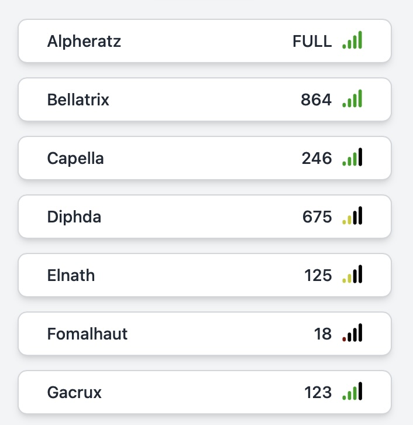

# delaborio

An mmorpg game created to experiment with multiple technologies

Try it out here: https://puregero.github.io/delaborio/

## Technologies

### Multiple game servers

Multiple game servers are used to handle a high capacity of players. However,
unlike some other mmo games, the player data is shared between all game servers.
This means players aren't locked into a single server that they choose when they
first start the game, but can instead freely go between servers to where their
friends are.

### Multithreaded servers

The game servers themselves are completely multithreaded. After working with the
Minecraft game server for a long time, which it uses a single-threaded designed,
I wanted to experiment with the power of a multithreaded design. Unfortunately
this meant the game server couldn't be written using Node.js, as Javascript's
multithreading abilities aren't suitable for a high capacity game server.
Instead Java was used as I am very familiar with it's multithreading abilities.